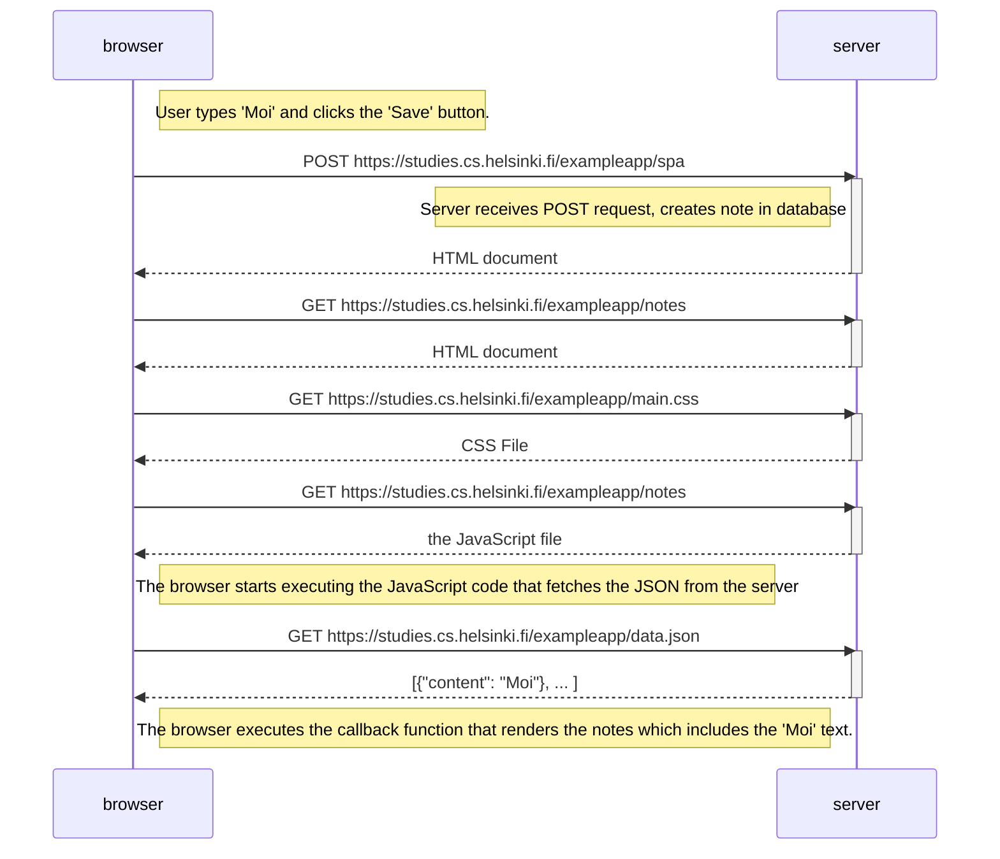

```mermaid
    sequenceDiagram
    participant browser
    participant server

        Note right of browser: User types 'Moi' and clicks the 'Save' button.
        browser->>server: POST https://studies.cs.helsinki.fi/exampleapp/spa
        activate server
        Note left of server: Server receives POST request, creates note in database
        server-->>browser: HTML document
        deactivate server

        browser->>server: GET https://studies.cs.helsinki.fi/exampleapp/notes
        activate server
        server-->>browser: HTML document
        deactivate server

        browser->>server: GET https://studies.cs.helsinki.fi/exampleapp/main.css
        activate server
        server-->>browser: CSS File
        deactivate server

        browser->>server: GET https://studies.cs.helsinki.fi/exampleapp/notes
        activate server
        server-->>browser: the JavaScript file
        deactivate server

        Note right of browser: The browser starts executing the JavaScript code that fetches the JSON from the server

        browser->>server: GET https://studies.cs.helsinki.fi/exampleapp/data.json
        activate server
        server-->>browser: [{"content": "Moi"}, ... ]
        deactivate server

        Note right of browser: The browser executes the callback function that renders the notes which includes the 'Moi' text.


```
