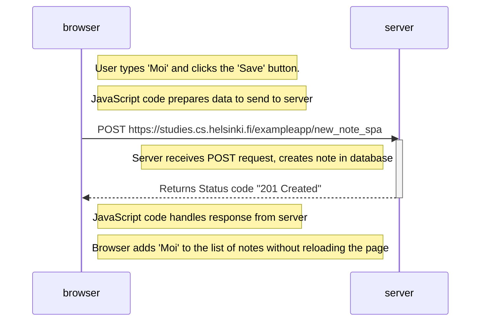

```mermaid
    sequenceDiagram
    participant browser
    participant server
        Note right of browser: User types 'Moi' and clicks the 'Save' button.

        Note right of browser: JavaScript code prepares data to send to server

        browser->>server: POST https://studies.cs.helsinki.fi/exampleapp/new_note_spa
        activate server
        Note left of server: Server receives POST request, creates note in database
        server-->>browser: Returns Status code "201 Created"
        deactivate server

        Note right of browser: JavaScript code handles response from server

        Note right of browser: Browser adds 'Moi' to the list of notes without reloading the page

```
